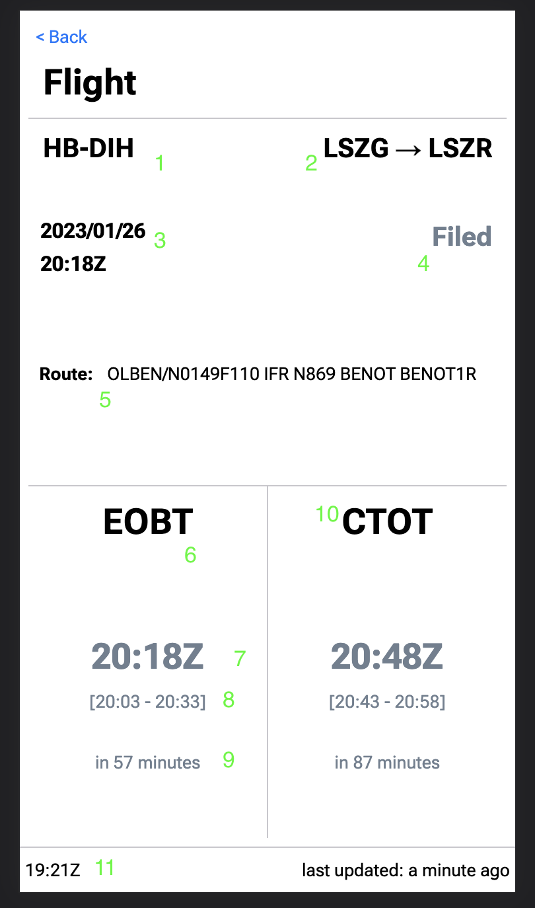

# Flight Plan Clock

This project is made of several JS applications working together,
 which can be found in the `/apps` folder.

## Purpose

The Flight Plan Clock is designed for pilots who use the 
Autorouter application to prepare and file their flight plans.

The purpose of the application is to provide a way for such a 
pilot to see what flight plans he has filed and quickly review:
- their status
- the departure times
  - either the *EOBT*, which is the time
at which he should leave the parking position with the plane
  - either the *CTOT*, which is the time at which he should 
take off (only provided in some cases)

## Example

Here is an example of the frontend app's flight plan detail page.

1. Call sign of the flight
2. Airport of departure and destination 
(using each airport's ICAO code)
3. Date and time of departure in UTC (same as the EOBT below)
4. Flight plan status
5. Planned route as submitted in the flight plan
6. EOBT: "estimated off-block time", the time of departure from
the parking position submitted in the flight plan
7. The EOBT in UTC (the 'Z' in the 88:88Z format implies it's UTC)
8. The allowed tolerance, i.e. how early or late can the pilot
actually go
9. Time to the EOBT
10. CTOT: "calculated take-off time", the time at which air traffic
control wants the flight to take-off. Usually this is empty,
a CTOT is sent only when air traffic control is delaying the
flight
11. The current time in UTC format